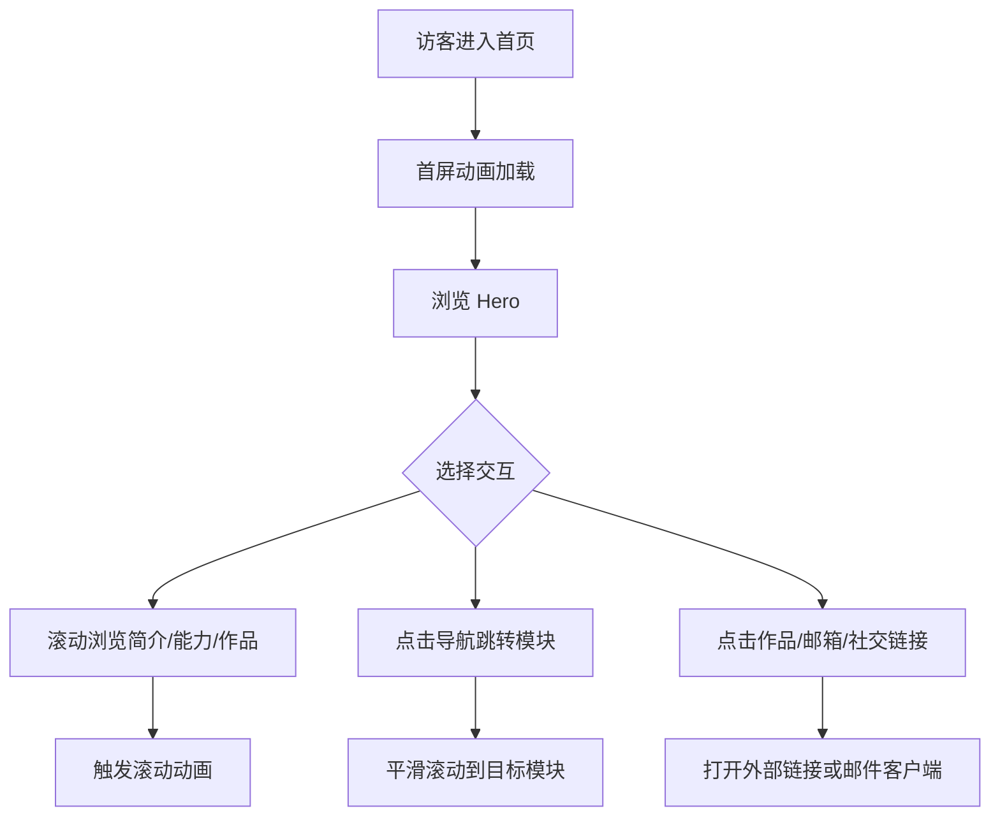

# 产品需求文档：个人简介落地页

## 1. 产品概述

为个人品牌打造的高质感首页落地页，聚焦展示姓名、身份定位、核心技能与精选作品。页面通过强烈的编辑式设计语言，让访客在首屏即可感知主人的专业气质与审美取向。

目标用户：潜在雇主、合作方、访客、招聘者。

## 2. 核心功能

### 2.1 用户角色

| 角色 | 访问方式 | 核心权限 |
|------|----------|----------|
| 访客 | 直接访问 | 浏览首页所有内容、点击社交/联系方式 |

### 2.2 功能模块

1. **首屏 Hero**：姓名展示、身份标语、主视觉、滚动提示
2. **个人简介**：精炼的自我介绍、职业经历时间线
3. **核心能力**：技能标签、服务领域、数据/成就亮点
4. **精选作品**：项目卡片、hover 动效、外部链接
5. **联系方式**：邮箱、社交媒体、简历下载入口
6. **全局导航**：固定顶部导航、平滑滚动、移动端菜单
7. **页脚**：版权信息、次要链接

### 2.3 页面详情

| 页面名称 | 模块名称 | 功能描述 |
|----------|----------|----------|
| 首页 | Hero 首屏 | 大字号姓名、身份副标题、装饰性头像/图形、向下滚动指示器 |
| 首页 | 个人简介 | 2 栏布局：左侧大段文字，右侧时间线/履历节点 |
| 首页 | 核心能力 | 4 组能力卡片 + 一组数据指标（数字滚动动画） |
| 首页 | 精选作品 | 3-4 个项目卡片，含标题、标签、简短说明与链接 |
| 首页 | 联系方式 | 大号邮箱 CTA、社交图标、简历下载按钮 |
| 首页 | 导航栏 | 固定顶部、透明背景、滚动后反色、移动端汉堡菜单 |
| 首页 | 页脚 | 版权、返回顶部、次要链接 |

## 3. 核心流程

访客打开页面后，首屏以 staggered 动画依次展现姓名、副标题与主视觉；访客可通过导航平滑滚动到任意模块，或通过滚动自然浏览；在作品卡片悬停时会出现高亮动效；点击邮箱或社交图标可跳转对应链接；移动端通过汉堡菜单展开导航。

## 4. 用户界面设计

### 4.1 设计风格

- **主色调**：暖白背景 `#F7F5F2`；深墨黑 `#1A1A1A` 作为文字主色；陶土红 `#C45D3E` 作为强调色，用于 hover 状态、按钮与关键数字。
- **辅助色**：米灰 `#E8E4DF`、中灰 `#6B6B6B`、浅边框 `#D9D5D0`。
- **按钮风格**：矩形微圆角（2px 圆角），实心黑底白字为主，悬停时反色或强调色填充。
- **字体**：标题使用 `Playfair Display`（衬线、优雅、编辑感），正文使用 `Source Han Serif CN / Noto Serif SC`（思源宋体，提升中文阅读质感），英文辅助标签使用 `Space Mono`（等宽，形成节奏对比）。
- **布局风格**：非对称网格、大字号标题、大量留白、部分内容刻意错位/重叠，营造杂志编辑般的阅读节奏。
- **图标/图形**：线性图标，少量几何装饰元素（细线、圆点、矩形色块）。

### 4.2 页面设计概述

| 页面名称 | 模块名称 | UI 元素 |
|----------|----------|---------|
| 首页 | Hero | 居中偏左大标题、等宽副标题、右侧装饰图形、向下滚动指示 |
| 首页 | 个人简介 | 左文右时间线、纵向细线连接履历节点、节点圆点 |
| 首页 | 核心能力 | 2×2 卡片网格、数字指标行、悬停上浮阴影 |
| 首页 | 精选作品 | 大卡片列表、图片占位、标签 pills、hover 遮罩 |
| 首页 | 联系方式 | 超大邮箱链接、社交图标行、简历下载按钮 |
| 首页 | 导航栏 | 左侧 Logo/姓名、右侧锚点链接、移动端汉堡菜单 |
| 首页 | 页脚 | 简洁版权文字、返回顶部按钮 |

### 4.3 响应式设计

- 桌面优先（1440px 基准），内容最大宽度 1280px 并居中。
- 平板（≤1024px）：网格由 2 列变为 1 列，字号按比例缩小。
- 移动端（≤640px）：导航变为汉堡菜单，Hero 标题缩小，时间线改为垂直堆叠，作品卡片全宽。
- 触控优化：按钮与链接最小点击区域 44×44px；移动端菜单全屏覆盖。

### 4.4 动效设计

- **页面加载**：姓名与副标题依次从下方淡入（`translateY(30px)` → `0`，stagger 100ms）。
- **滚动触发**：各模块进入视口时从下方淡入，使用 IntersectionObserver 或 CSS 动画类。
- **悬停交互**：导航链接 hover 出现下划线；卡片 hover 上浮 4px 并加深阴影；按钮 hover 背景反色。
- **数字动画**：能力指标数字从 0 滚动到目标值，持续 1.2s，带缓动。
- **滚动提示**：首屏底部箭头轻微上下循环浮动。
