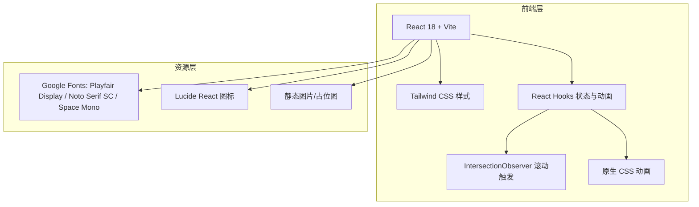

# 技术架构文档：个人简介落地页

## 1. 架构设计



## 2. 技术说明

- **前端框架**：React 18 + JSX
- **构建工具**：Vite 5
- **样式方案**：Tailwind CSS 3，配合自定义 CSS 变量与关键帧动画
- **图标库**：`lucide-react`
- **字体来源**：Google Fonts
- **后端**：无
- **数据库**：无
- **部署产物**：纯静态 HTML/CSS/JS，可直接部署至任意静态托管服务

## 3. 路由定义

| 路由 | 用途 |
|------|------|
| `/` | 首页，包含所有模块的单页应用 |

## 4. 目录结构

```
/workspace/
├── .trae/documents/        # 产品需求与技术架构文档
├── public/
│   └── profile.jpg         # 头像/主视觉占位图（可选）
├── src/
│   ├── App.jsx             # 页面主组件，组合所有模块
│   ├── main.jsx            # 应用入口
│   ├── index.css           # 全局样式、字体引入、CSS 变量、动画关键帧
│   ├── components/
│   │   ├── Navbar.jsx      # 固定导航栏 + 移动端菜单
│   │   ├── Hero.jsx        # 首屏
│   │   ├── About.jsx       # 个人简介 + 时间线
│   │   ├── Skills.jsx      # 核心能力 + 数字动画
│   │   ├── Works.jsx       # 精选作品
│   │   ├── Contact.jsx     # 联系方式
│   │   ├── Footer.jsx      # 页脚
│   │   ├── ScrollReveal.jsx # 滚动显现包装组件
│   │   └── AnimatedNumber.jsx # 数字滚动组件
│   └── data/
│       └── profile.js      # 个人资料、履历、项目、技能等静态数据
├── index.html
├── tailwind.config.js
├── postcss.config.js
├── vite.config.js
└── package.json
```

## 5. 关键实现说明

### 5.1 滚动触发动画

使用自定义 `ScrollReveal` 组件包裹各模块。组件内部使用 `IntersectionObserver` 监听元素进入视口，进入后添加 CSS 类触发 `opacity` 与 `transform` 动画。

### 5.2 数字滚动动画

`AnimatedNumber` 组件接收目标值，在滚动进入视口后使用 `requestAnimationFrame` 实现从 0 到目标值的递增动画，配合缓动函数 `easeOutQuart`。

### 5.3 平滑滚动导航

导航链接使用锚点（`#about`、`#skills` 等），点击时调用 `element.scrollIntoView({ behavior: 'smooth' })`，并关闭移动端菜单。

### 5.4 响应式导航

桌面端显示水平链接列表；移动端使用状态控制汉堡菜单的展开/收起，菜单以全屏覆盖形式呈现。
